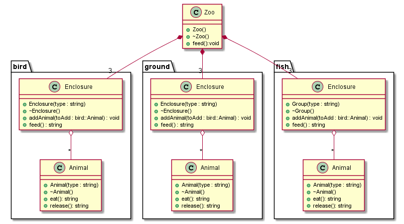

# namespaces and constructors/destructors

Erstellen Sie nach folgendem Klassendiagramm einen Zoo mit jew. zwei Gehegen und <5 Tieren.
Nach dem Sie die Tiere ein paar mal gefüttert haben (Ausgabe durch die Fütter-Funktion des Zoos) müssen Sie den Zoo schließen.

Wird ein Gehege geschlossen, werden die Tiere freigelassen und verabschieden sich.

## UML

## mögliche Ausgaben
Zoo wird angelegt:
    Pinguin(<- typ)-Wasserbecken wird angelegt:
        neuer Pinguin
        ...

Fütterungszeit:
    Pinguin-Gehege wird gefüttert:
        Pinguin ist
        ....

Zoo wird aufgelöst:
    Pinguin-Gehege wird aufgelöst:
        Pinguin in Freiheit entlassen
        ....